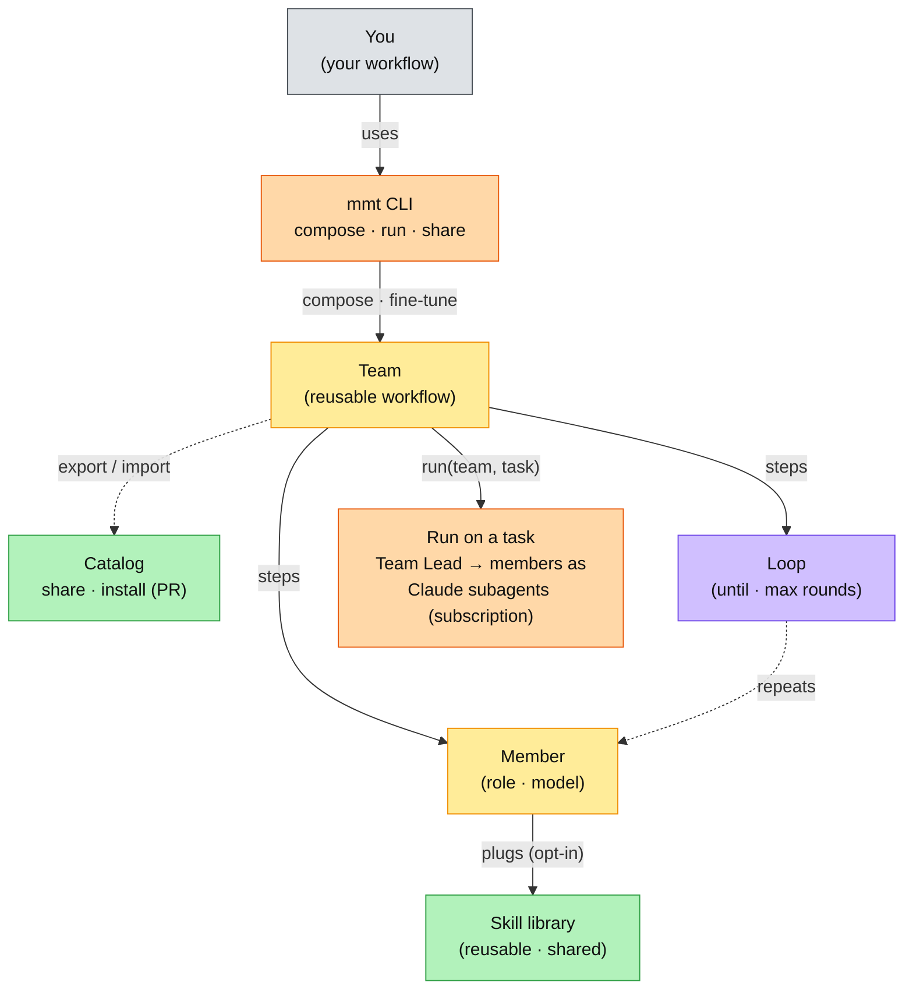

# my-mini-team

**Compose your own agent workflows, reuse them by name, run them on any task, and watch every step.**

> Stop doing the work. Architect the team that does it.

`my-mini-team` (CLI: `mmt`) lets you encode *your* way of shipping work as a named, reusable **workflow** — a team of members (roles) with skills and loops — then run it on any task and follow it step by step. You describe the team in plain words; an agent composes it; you refine by talking.

## Architecture

You fine-tune reusable **Teams** with the `mmt` CLI, then run them on any task. A Team is made of **Members** (roles, each with a model and skills) and **Loops**; members plug reusable **Skills**; at run time a **Team Lead** orchestrates the members as Claude subagents on your subscription; and Teams are shared through the **Catalog**.



> **Status: v0.1 UX prototype.** Everything below works, but a *run* is currently **simulated** (fake PR/timings) so the experience can be felt end to end. Wiring members to real Claude Code subagents is the next step.

---

## Install

Node 18+. Zero dependencies. Composing (`new`/`edit`) uses your local `claude` CLI.

```bash
git clone https://github.com/mamadoudicko/my-mini-team
cd my-mini-team
npm link          # puts `mmt` on your PATH  (or just run: node bin/mmt …)
```

## Quick start

```bash
mmt                                         # home: discover your teams
mmt show task-shipper                       # the full workflow (steps · skills · loops)
mmt run task-shipper "add SMS reminders"    # run it, watch every step live
mmt new                                     # compose a new team (describe it in plain words)
```

## The model

```
Team  (a named workflow)
 └─ steps  (ordered)
     ├─ Member   → a role + what it does + [skills]
     └─ Loop     → until <condition> · max_rounds → steps → Members
Skill  (a reusable capability definition, referenced by a member; shared across teams)
```

- A **team** is an ordered list of **steps**.
- A **step** is a **member** (a role) or a **loop** of members (repeats `until` a condition, capped by `max_rounds`).
- A **member** plugs in **skills** — reusable capabilities (`SKILL.md` files) that live in a shared library, so editing one updates it everywhere.

## Commands

| Command | What it does |
| --- | --- |
| `mmt` | home — list your teams (with `[local]`/`[global]` scope) |
| `mmt show <team>` | full workflow: steps, skills, loops |
| `mmt run <team> "task"` | run it with a live step tracker (`--fast` to speed the demo) |
| `mmt new ["describe it"]` | compose a team from a plain-language description (`--local` to scope to this folder) |
| `mmt edit <team> ["change"]` | change a team by describing it in words |
| `mmt delete <team>` | delete a team (all copies) |
| `mmt skills` | list reusable skills you can plug into a member |
| `mmt skill new\|edit\|show <name>` | create / edit / view a skill definition |
| `mmt export <team> [--raw]` | portable token (bundles skill definitions) or `--raw` yaml |
| `mmt import '<token>'` | recreate a team from a token, yaml, or file |
| `mmt help` | list everything |

## Composing by describing it

No forms. Describe the workflow; the agent composes it; you refine by talking.

```bash
mmt new
# opens your editor — write the description, save & close:
#   strategist plans, coder builds and opens a PR and updates the ticket,
#   reviewer comments on github and loops with the coder until approved,
#   then qa runs tests and posts results
# -> shows the composed workflow -> type a change, or press enter to save
```

## Skills (reusable capabilities)

Skills are real definitions, not labels. A member plugs one in by name or path; edit it once, it updates everywhere.

```bash
mmt skills                    # discovers mmt skills AND your existing Claude Code skills
mmt skill edit github-pr      # elementary edit — opens the definition in your editor
mmt edit task-shipper "plug the deploy skill into the coder"
```

## Local vs global

Teams live in one of two scopes (like `git config --local`/`--global`):

- **global** (default) — `~/.my-mini-team/teams/`, available from any directory.
- **local** (`mmt new --local`) — `./teams/`, belongs to this project (commit it with the repo).

Local shadows global when names collide; the home list tags each so you can tell.

## Sharing (export / import)

Export is deterministic — it ships the team's actual definition, not an agent re-derivation, so a copy-paste recreates it exactly. The token **bundles the skill definitions** too, so a shared team works on someone else's machine.

```bash
mmt export task-shipper          # prints:  mmt import 'mmt2:…'   (copy the whole line)
mmt import 'mmt2:…'              # recreate the team + install its skills
```

## Observability

`mmt run` is watchable: the workflow *is* the progress bar. You see total elapsed time, per-member time, which loop round it's on, which steps are pending, and when it's **waiting for you** (a human-approval gate).

**Opt-in run audit.** Add a `reporter` member (plugging the `publish-report` skill), or set `report: github` on a team, and a run posts a concise audit — steps, per-member time, rounds, verdicts, total, and a link to the full report — as a collapsible comment on the PR. It is strictly opt-in: teams without a `reporter`/`report: github` post nothing.

## Concepts recap

- **Team** = a workflow you name and reuse.
- **Member** = a role in that workflow, with skills attached.
- **Loop** = a step group that repeats until a condition (bounded by `max_rounds`).
- **Skill** = a reusable capability, referenced by members, shared across teams.

## Catalog

Mini-teams shared by the community. Add yours via PR (see CONTRIBUTING) — do not hand-edit below.

<!-- mmt:catalog:start -->
- [mamadoudicko/task-shipper](catalog/mamadoudicko/task-shipper/) — ship a task end to end — plan, build, review loop, qa, release notes
<!-- mmt:catalog:end -->

## License

MIT
