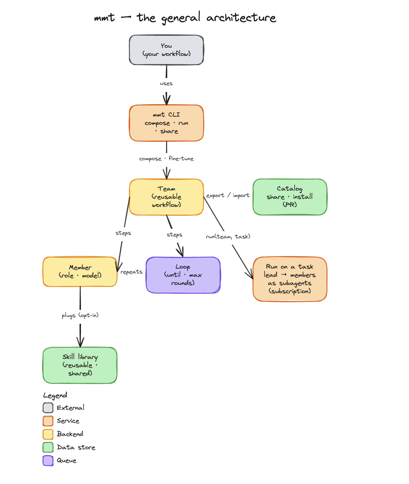

# my-mini-team

[](https://www.npmjs.com/package/@mamadoudicko/mmt)
[](https://nodejs.org)
[](LICENSE)

**Compose your own agent workflows, reuse them by name, run them on any task, and watch every step.**

> Stop doing the work. Architect the team that does it.

`my-mini-team` (CLI: `mmt`) lets you encode *your* way of shipping work as a named, reusable **workflow** — a team of members (roles) with skills and loops — then run it on any task and follow it step by step. You describe the team in plain words; an agent composes it; you refine by talking.

## Architecture

`my-mini-team` is three stacked layers. Native **Skills** (`SKILL.md` capabilities) plug into **Agents** (roles with a model and a default skill set); Agents compose into **Teams** — mmt's own, proprietary layer — as ordered steps and loops. You fine-tune a team with the `mmt` CLI, then run it on any task: `mmt run <team>` orchestrates its agents as in-session Claude subagents on your subscription (via the `/mmt` skill — not `claude -p`). Teams are shared as reviewable bundles (`mmt export`/`mmt import`).

<p align="center">
  
</p>

> **v0.1** — composing, editing, sharing, and the live step-tracker experience are all real and work today. A *run* currently **simulates** execution (fake PR/timings) so you can feel the full flow end to end; wiring members to real Claude Code subagents is the next step and lands soon.

---

## Install

Node 18+. Zero dependencies. Composing (`new`/`edit`) and running use your local `claude` CLI.

```bash
npm i -g @mamadoudicko/mmt      # puts `mmt` on your PATH
# …or run it without installing:
npx @mamadoudicko/mmt
```

Installing runs a **postinstall** that sets up the runtime so everything works out of the box: it installs the `/mmt` slash command into `~/.claude/commands/` (the one that drives `mmt run`/`new`/`edit` inside a Claude Code session). It never touches your own teams, agents, or skills. Opt out with `MMT_NO_POSTINSTALL=1`.

<details>
<summary>Install from source (for contributing)</summary>

```bash
git clone https://github.com/mamadoudicko/my-mini-team
cd my-mini-team
npm link          # puts `mmt` on your PATH  (or just run: node bin/mmt …)
```
</details>

## Quick start

```bash
mmt                                         # home: discover your teams (empty on a fresh install)
mmt new team my-team "strategist plans, coder builds and opens a PR, reviewer loops until approved, then qa runs tests"
mmt show team my-team                       # the full workflow (steps · skills · loops)
mmt run my-team "add SMS reminders to booking confirmations"    # run it, watch every step live
```

## The model

```
Team  (a named workflow)
 └─ steps  (ordered)
     ├─ Member   → a role + what it does + [skills]
     └─ Loop     → until <condition> · max_rounds → steps → Members
Skill  (a reusable capability definition, referenced by a member; shared across teams)
```

- A **team** is an ordered list of **steps**.
- A **step** is a **member** (a role) or a **loop** of members (repeats `until` a condition, capped by `max_rounds`).
- A **member** plugs in **skills** — reusable capabilities (`SKILL.md` files) that live in a shared library, so editing one updates it everywhere.

## Commands

| Command | What it does |
| --- | --- |
| `mmt` | home — list your teams (with `[local]`/`[global]` scope) |
| `mmt list teams\|agents\|skills` | list what you have (aliases: `mmt teams` · `mmt skills` · `mmt agents`) |
| `mmt run <team> "task"` | run it with a live step tracker (`--fast` to speed the demo) |
| `mmt new team\|agent\|skill <name> [text]` | create one — bare = describe it, Claude drafts it; `--ui` = author it yourself |
| `mmt edit team\|agent\|skill <name> ["change"]` | update one — bare = describe the change; `--ui` = edit it yourself |
| `mmt show team\|agent\|skill <name>` | print one |
| `mmt delete team\|agent\|skill <name>` | delete one (alias: `rm`) |
| `mmt export <team> [dir]` | write a reviewable bundle: `team.yaml` + `agents/` + `skills/` (`--force` to overwrite) |
| `mmt import <dir>` | install a bundle after a manifest + consent (or legacy `mmt import '<token>'`) |
| `mmt help` | list everything |

## Composing by describing it

No forms. Describe the workflow; the agent composes it; you refine by talking.

```bash
mmt new team <name>
# Claude drafts it from your description; add --ui to build it by hand instead:
#   strategist plans, coder builds and opens a PR and updates the ticket,
#   reviewer comments on github and loops with the coder until approved,
#   then qa runs tests and posts results
# -> shows the composed workflow -> type a change, or press enter to save
```

## Skills (reusable capabilities)

Skills are real definitions, not labels. A member plugs one in by name or path; edit it once, it updates everywhere.

```bash
mmt skills                    # discovers mmt skills AND your existing Claude Code skills
mmt edit skill github-pr      # elementary edit — opens the definition in your editor
mmt edit team my-team "plug the deploy skill into the coder"
```

## Local vs global

Teams live in one of two scopes (like `git config --local`/`--global`):

- **global** (default) — `~/.my-mini-team/teams/`, available from any directory.
- **local** (`mmt new team <name> --local`) — `./teams/`, belongs to this project (commit it with the repo).

Local shadows global when names collide; the home list tags each so you can tell.

## Sharing (export / import)

`mmt export <team> [dir]` writes a reviewable **directory bundle** — `<team>.team.yaml` plus its `agents/` and `skills/` — into `dir` (defaults to `./<team>`).
The recipient reviews the bundle, then `mmt import <dir>` installs it after printing a manifest and asking for consent.
A base64 token shared out-of-band still works as a legacy inbound form: `mmt import '<token>'`.

```bash
mmt export my-team ./my-team             # writes my-team.team.yaml + agents/ + skills/
mmt import ./my-team                     # review the manifest, then install
```

## Observability

`mmt run` is watchable: the workflow *is* the progress bar. You see total elapsed time, per-member time, which loop round it's on, which steps are pending, and when it's **waiting for you** (a human-approval gate).

**Opt-in run audit.** Add a `reporter` member (plugging the `publish-report` skill), or set `report: github` on a team, and a run posts a concise audit — steps, per-member time, rounds, verdicts, total, and a link to the full report — as a collapsible comment on the PR. It is strictly opt-in: teams without a `reporter`/`report: github` post nothing.

## Concepts recap

- **Team** = a workflow you name and reuse.
- **Member** = a role in that workflow, with skills attached.
- **Loop** = a step group that repeats until a condition (bounded by `max_rounds`).
- **Skill** = a reusable capability, referenced by members, shared across teams.

## License

MIT
